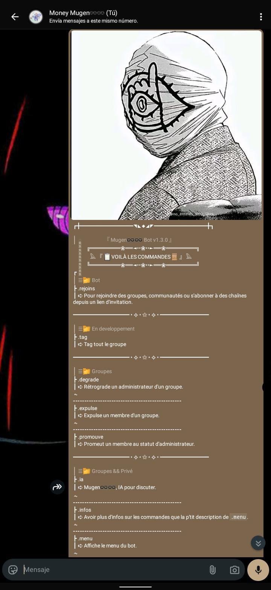

# Mugen WA Bot ♾️♾️  


[](https://nodejs.org/fr)
[](https://github.com/WhiskeySockets/Baileys)

[](https://github.com/moneythemoney999/mugen_wa_bot?tab=MIT-1-ov-file)

* Un bot WhatsApp puissant et modulaire, très flexible et totalemnt en français (dans el bon sens du terme puisque même le code est francisé)

## ~Table des matières~

- [À propos](#à-propos)
- [Fonctionnalités](#fonctionnalités)
- [Technologies Utilisées](#technologies-utilisées)
- [Prérequis](#prérequis)
- [Installation](#installation)
- [Utilisation](#utilisation)
  - [Démarrage du bot](#démarrage-du-bot)
  - [Authentification](#authentification)
  - [Commandes](#commandes)
  - [Outils](#outils)
- [Structure du Projet](#structure-du-projet)
- [Contribuer](#contribuer)
- [Licence](#licence)
- [Auteur](#auteur)

## ~À propos~

Mugen WA Bot♾️♾️ est un bot WhatsApp polyvalent et extensible, créer par un petits devs independants, construit avec Node.js et utilisant la bibliothèque Baileys pour interagir avec l'API WhatsApp Multi-Device. Sa conception modulaire permet d'ajouter facilement de nouvelles commandes et outils. Il est capable de gérer plusieurs sessions simultanément.

## ~Fonctionnalités~

🧩 **Modulaire et Extensible** : Ajoutez facilement de nouvelles commandes et outils personnalisés.
💬 **Interactions WhatsApp** : Gère les messages, les groupes et les participants...
♾️  **Gestion Multi-Sessions** : Exécute plusieurs instances du bot simultanément avec des sessions et numéro distinctes.
🔌 **Authentification Flexible** : Supporte l'authentification par QR Code ou code de pairage.
🎨 **Journalisation Améliorée** : Logs colorés pour une meilleure visibilité des activités du bot.
⚙️  **Système de Mémoire Persistante** : Chaque commande et outil peut maintenir un état propre à chaque session.

## ~Technologies Utilisées~

*   **Node.js** (20+)
*   **@whiskeysockets/baileys** (API WhatsApp Multi-Device)
*   **qrcode-terminal** (Génération de QR codes dans le terminal)
*   **pino** (Logger optimisé)
*   Et d'autres modules Node.js standards comme `fs`, `path`, `readline`, `util`.

## ~Prérequis~

Avant de commencer, assure toi d'avoir les éléments suivants installés :

*   **Node.js** (version 20 ou supérieure recommandée)
*   **npm** ou **yarn** (gestionnaire de paquets)

## ~Installation~

Suis ces étapes pour configurer et exécuter le bot :

1.  **Clone le dépôt :**
    ```bash
    git clone https://github.com/moneythemoney999/mugen_wa_bot.git
    cd mugen_wa_bot
    ```

2.  **Installe les dépendances : **
### **Installe les dépendances : **
    ```bash
    npm install
    # ou
    yarn install
    ```

### Utillistaeurs de termux sans environement linux
**Pour les utilisateur de termux (simple sans environement linux installer dessus) il faut pas lancer utiliser `npm/yarn install`puisque l'un des paquets nécessaire n'et pas pré-compilé pour termux.**

- Alors moi j'ai je l'ai fait pour vous mais il faut utiliser specifiquements node v24.14.1
- Pour en beneficié il faut lancé deux commandes:
  ```bash
  chmod +x installation.sh && ./installation.sh #l'une permete de donné les autorisation d'execution au fichier et l'autre l'execute
  ```

3.  **Configuration des sessions (Optionnel, mais recommandé pour plusieurs sessions) :**
    Crées un fichier `session.js` à la racine du projet (au même niveau que `mugen_wa_bot.js`). Dans ce fichier, tu peux définir les sessions que tu souhaites lancer. Chaque appel à `demarrerBot()` lancera une nouvelle session.

    Exemple de `session.js` :
    ```javascript
    demarrerBot("session")

    // Lance une session par défaut
    demarrerBot("mugen");

    // Lance une autre session nommée "session1"
    // demarrerBot("session1");

    // Tu peux commenter/décommenter les lignes selon les sessions que tu veux activer.
    // Les sessions non commentées seront démarrées au lancement du bot.
    ```
    Si `session.js` n'existe pas ou est vide, une session par défaut nommée "mugen" sera lancée.

## ~Utilisation~

### Démarrage du bot

Pour démarrer le bot, exécute le fichier principal `mugen_wa_bot.js` :

```bash
node mugen_wa_bot.js
```

### Authentification

Lors du premier démarrage d'une nouvelle session, le bot te demandera de choisir une méthode d'authentification :

1.  **QR Code** : Un QR code s'affichera dans le terminal. Scanne-le avec ton tél via WhatsApp > Appareils connectés > Connecter un appareil. Puis tu scanne.
2.  **Code de pairage** : Tu dois entrer votre numéro de téléphone sans espace ni le plus ou parenthèses. Un code te sera fourni, que tu dois aller le tapper dans WhatsApp > Appareils connectés > Connecter un appareil > Connecté plutôt avec un numéro de téléphone. Puis tu le tappe

- Les fichier d'auth seront sauvegardées dans le dossier `.secret/.auth/<nom_de_session>` pour les redémarrages futurs.
- Donc touches pas sans une bonnes raison.

### Commandes

* Le bot écoute les messages commençant par le préfixe `.` (point). Et va regarder le dossier `commandes` pour voir de quelle commande il s'agit et l'appeller 
* _Pour le chargement automatique et recherche des commandes il ya certaine case à respecter_
* **Voilà un exemple :**
```javascript
  nom : "nom de la commande",
  description : "description de la commande",
  categorie : "catégorie de la commande",
  infos : "Plus d'info sur la la commnde que le bloc 'description'", //pas obligatoire
  execute : "c'est là la vrai logique de la commande qui sera exécuté à l'appelle {s'il y'a des argument que tu veux importe depuis le fichier princ c'est ici}",
```

### Outils

- Le bot utilise un système d'outils modulaires qui peuvent réagir à différents événements. Ces outils sont chargés dynamiquement depuis le dossier `outils`.
- Et de même pour les commandes il y'a certaine cases à respecter.
- __Exemple__ : 
```javascript
export defaut { 
  nom : "nom de l'outil",
  evenement : "l'evenement que veut ecouter cette commande", //peut prende un ou plusieurs
  desciption : "descrption de l'outil",
  categorie : "...",
  infos : "...",
  affiche_menu : "{vrai/faux}", ce bloque permet de ne pas ajouter l'outils dans le menu du bot si c'est destiné à travailler en arrière plan. S'il n'est pas dans le fichier ou defini sur `faux` le menu ne l'affichera pas.
  execute : "de même pour les commandes c'est là que se trouvera la logique à executé"
```

## Structure du Projet

```
.
├── commandes/             # Contient les modules de commande du bot
├── outils/                # Contient les modules d'outils pour des fonctionnalités événementielles
├── memoires/              # Dossier pour les données persistantes (sessions, commandes, outils)
│   ├── memoires_commandes/
│   ├── memoires_sessions/
│   └── memoires_outils/
├── .secret/               # Contient les données d'authentification des sessions WhatsApp
│   └── .auth/
├── mugen_wa_bot.js        # Le point d'entrée principal du bot
├── package.json           # Informations sur le projet et les dépendances
├── package-lock.json      # Verrouillage des versions des dépendances
├── session.js             # Fichier pour configurer et lancer plusieurs sessions
└── README.md              # Ce fichier !
```

## Contribuer

Comme j'ai dis c'est projet ou je bosse solo puisque j'aime un peu mieux ça mais s'il y'a des gens qui souhaite contribuer chuis pas contre😅♾️.
Aller je vous attend ♾️♾️.

## Licence

Ce projet est sous licence MIT.
[Licence](LICENCE)
## Auteur

Money Mugen♾️♾️
